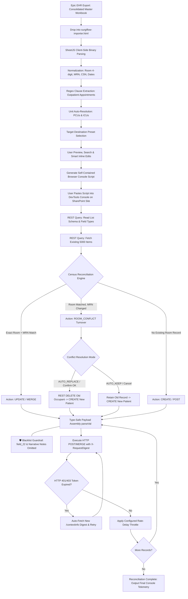

# SurgiFlow Bulk Import & Census Reconciliation Process Specification

## Executive Architecture & Clinical Intent

The **SurgiFlow Bulk Importer (`surgiflow-importer.html`)** is a specialized, zero-infrastructure client application engineered to ingest Epic EHR inpatient census workbooks, clinical metrics, and laboratory panels, then reconcile and synchronize the data directly into SharePoint Online lists serving as the SurgiFlow database.

This process enforces authoritative bedside data integrity across 5 hospital instances:

* **SurgiFlow Master:** `/teams/SurgiFlow` (Consolidated hospital-wide census including all Stepdown PCUs and ICUs)
* **GT6 CPPCU:** `/sites/group-gt6leadershipteamgroup` (Rooms 6801–6840)
* **GT7 CPCU:** `/teams/GT7Charge` (Rooms 7801–7840)
* **GT8 CVPCU:** `/teams/group-reliefchargecvpcu` (Rooms 8801–8840)
* **WT8 STPCU:** `/teams/WT8Charge` (Rooms 8901–8936)

---

## Process Flowchart: End-to-End Ingestion & Reconciliation



---

## Detailed Step-by-Step Execution Guide

### Step 1: Destination List Configuration & Safeguards Setup

1. **Target Selection via Presets:**
   * Select the target destination list from the preset selector:
     * `🌐 SurgiFlow Master (All Units & ICUs)`
     * `🫀 GT6 CPPCU (6801–6840)`
     * `💓 GT7 CPCU (7801–7840)`
     * `🩺 GT8 CVPCU (8801–8840)`
     * `🫁 WT8 STPCU (8901–8936)`
   * Selection auto-populates the target **Site Path**, **List Title**, and applies the appropriate **Unit Filter**.
2. **Execution Timing & Throttling Configuration:**
   * **Rate Delay:** Set to `450 ms (Normal)` to adhere to SharePoint Online REST API throttling limits and avoid `429 Too Many Requests`. Set to `200 ms` only on small batches or `1000 ms` during peak network utilization.
   * **Pause Every:** Configurable batch interruptions (Continuous, Every 25, Every 50) allowing manual review before proceeding with large sets.
3. **Room Conflict Policy:**
   * Configure `🔄 Room Conflict`:
     * `ASK_ONCE` (Recommended): Prompts once globally if any bed occupant turnover is identified, applying the chosen strategy across all identified turnovers.
     * `AUTO_REPLACE`: Automatically deletes prior occupants from recycled beds and initializes new patient records without prompt interruption.
     * `AUTO_KEEP`: Retains historical records and creates parallel entries.
     * `ASK_EACH`: Prompts interactively on every individual room turnover.

---

### Step 2: Source File Ingestion & Parsing

1. **Workbook Ingestion:**
   * User drags and drops the unified Epic hospital workbook: `SURGIFLOW_Master_Cardiac_Hospital_YYYYMMDD_HHMM.xlsx` (or `.csv`) into the designated drop zone.
   * Alternatively, supplemental dual-drop zones support splitting primary Census/Readmissions from secondary Labs/Vitals workbooks.
2. **SheetJS Binary Extraction:**
   * The client runtime uses `XLSX.read` in array buffer mode to parse the active worksheet.
   * First-row header arrays are extracted and mapped against key clinical candidate arrays via case-insensitive and punctuation-agnostic fuzzy matching (`findVal`).
   * Completely empty rows are stripped.

---

### Step 3: Clinical Normalization & Feature Extraction

1. **Room Number Extraction (`normalizeRoom`):**
   * Regex extraction isolates the 4-digit room designator (`\b\d{4}\b`), validating within valid hospital room numbers (`2000`–`9999`).
2. **Unit Allocation (`resolveUnitFromRoom`):**
   * Clinical unit names are strictly parsed and normalized into 3 or 4 character codes (no extended department names):
     * **GT6:** 6801–6840 (Floor 6 CPPCU)
     * **GT7:** 7801–7840 (Floor 7 CPCU)
     * **GT8:** 8801–8840 (Floor 8 CVPCU)
     * **WT8:** 8901–8936 (West Tower Floor 8 STPCU)
     * **ACSU:** 9901–9940 (Advanced Cardiac Surgical Unit)
     * **CVICU:** 2701–2740 (Cardiothoracic Intensive Care Unit)
     * **CICU:** 5801–5840 (Cardiac Intensive Care Unit)
     * **MSICU:** 3201–3240 / **VTICU:** 4801–4840
3. **Encounter Identification Normalization:**
   * **MRN:** Strips leading zeroes (`normalizeMRN`) to avoid alphanumeric comparison mismatches.
   * **CSN:** Strips commas and white-space (`normalizeCSN`), preserving the authoritative patient encounter identifier.
4. **Smart Appointment Clause Extractor (`extractAppointments`):**
   * Parses freeform care navigation and nurse coordinator notes.
   * Splits text on clause delimiters (`.`, `and`, `;`, `, but`).
   * Applies multi-regex heuristics to identify:
     * **Specialty:** PCP, Cardiology, CT Surgery, Pulmonology, Urology, Oncology, Transplant.
     * **Appointment Date/Time:** Standard date strings (`M/D`, `Month D, YYYY`) and time patterns (`hh:mm am/pm`).
     * **Provider:** Evaluates Dr. / Provider names while filtering out false-positive day/month nouns.
   * Deduplicates and structures output into uniform syntax: `[Specialty] — [Date] [Time] with [Provider]`.
5. **Clinical Choice Normalization:**
   * Readmission risk strings are parsed into standardized SharePoint Choice options: `Low <12%`, `Medium 13% to 22%`, or `High >22%`.

---

### Step 4: Pre-Import Inspection & Inline Modification

1. **Filtering & View Partitioning:**
   * Unit filter tabs enable clinical triage coordinators to isolate individual unit footprints or review the entire consolidated house (`All Units`).
   * Dynamic search box evaluates patient name, room, MRN, CSN, diagnosis, surgery, service line, and attending physician.
2. **Bedside Note Editing:**
   * Coordinator can review extracted appointments and clinical notes inside an inline editable textarea (`.appt-editor`), appending or refining clinical notes prior to database commit.
3. **Unit Partitioning on Generation:**
   * If a specific unit preset (e.g., `GT8 CVPCU`) is active, the generator isolates only patients belonging to that unit, preventing cross-unit list pollution.

---

### Step 5: Live SharePoint Schema Synchronization & Narrative Notes Protection

When the generated script runs in the SharePoint browser session:

1. **Endpoint Resolution:**
   * Identifies list endpoint via `_spPageContextInfo.pageListId` if available, or falls back to `/web/lists/getbytitle('[List Title]')`.
2. **Schema Introspection:**
   * Queries `_api/web/lists/.../fields?$select=Title,InternalName,TypeAsString,Hidden,ReadOnlyField,Choices`.
   * Filters out `Hidden`, `Calculated`, and non-Title `ReadOnlyField` elements.
3. **Field Alias Resolution Map:**
   * Dynamically resolves internal SharePoint column names across variable schemas (handling differences between Master and unit-specific legacy columns such as `field_1`, `field_8`, `field_18`, `field_20`, `field_23`, `CSN0`, `Potassium_x0020__x0028_K_x002b__`, etc.).

---

## 🛡️ Clinical Narrative Notes Protection & Write-Avoidance Architecture

A foundational tenet of the SurgiFlow architecture is that **automated census ingestion must NEVER write to, modify, or erase clinician-authored narrative shift notes**.

### 1. The Bedside Clinical Risk

During shifts, bedside nurses, charge nurses, case managers, and physicians enter sensitive, real-time narrative updates directly into SurgiFlow:

* **`Clinical Needs to Continue Admission` (`field_22` / `ClinicalNeeds`):** Details acute patient acuity, chest tube drainage outputs, inotropic/vasoactive IV drip titrations, epicardial pacing wire status, rhythm dysrhythmias, and ongoing clinical justification for hospitalization.
* **`Discharge Barriers` / `Care Coordination Remarks`:** Multidisciplinary notes regarding physical therapy clearance, social work placement, home oxygen orders, and wound care instructions.
* **`Nursing Handoff & Shift Huddle Notes`:** Intra-shift clinical handoff commentary.

If an automated bulk script were to map raw Epic notes or blank columns into these fields, **hours of critical bedside clinical documentation would be irrevocably overwritten or erased**.

### 2. The Multi-Layered Protection Mechanisms

| Protection Layer | Implementation Mechanism | Clinical Guarantee |
| :--- | :--- | :--- |
| **Strict Payload Blacklist** | `buildItemBody()` explicitly omits `field_22`, `ClinicalNeeds`, and general narrative fields. | Even if Epic exports contain text, the importer engine never generates a write key for narrative columns. |
| **Clause-First Note Extraction** | `extractAppointments()` scans freeform text using targeted regex. | Extracts **only** validated outpatient appointment appointments (`[Specialty] — [Date] [Time] with [Provider]`). All other narrative is discarded. |
| **Isolated Target Field** | Extracted appointments write **exclusively** to `Appointment Detail` (`AppointmentDetail` / `field_19`). | Clinical nursing notes and appointment tracking remain in completely separate physical list columns. |
| **Append Mode vs. Wipe** | If existing appointments are present in `Appointment Detail`, the importer merges/appends rather than wiping out notes. | Prevents loss of manual annotations made by care navigation. |
| **Room Turnover Clean State** | When bed occupants change (`ROOM_CONFLICT`), the system deletes the old patient item instead of performing a MERGE. | Eliminates the critical risk of a new patient inheriting the previous occupant's historical shift notes or drip tallies. |

### 3. Historical Precedent & Rollback Safeguard

In earlier prototype iterations, unconstrained imports inadvertently touched `field_22` (`Clinical Needs to Continue Admission`). This triggered an immediate, automated SharePoint REST API version rollback across 149 patient rooms across all four PCU unit lists:

* **GT8 CVPCU (8800s):** 33 patient rooms restored to pre-import nursing versions.
* **GT6 CPPCU (6800s):** 40 patient rooms restored 2 versions back.
* **GT7 CPCU (7800s):** 40 patient rooms restored to nursing shift documentation.
* **WT8 STPCU (8900s):** 36 patient rooms restored to pre-import state.

Following this event, the **narrative write-avoidance guardrail** was permanently hardcoded into both `surgiflow-importer.html` and all standalone migration scripts. Narrative fields are treated as **read-only / clinician-owned** across all automated ingestion pipelines.

---

### Step 6: Census Reconciliation Engine Logic

The core reconciliation compares incoming Epic rows against existing SharePoint items:

```text
Incoming Epic Row:   [Room, MRN, Patient Name, CSN]
SharePoint Existing: [Room, MRN, Patient Name, ItemId]
```

#### Rule A: Authoritative Exact Match (`UPDATE`)

* **Condition:**
  * `(spRoom === exRoom && spMRN === exMRN)` **OR**
  * `(spMRN === exMRN && (spName.includes(exName) || exName.includes(spName)))`
* **Action:** `UPDATE`
* **Execution:** HTTP POST with `X-HTTP-Method: MERGE` and `IF-MATCH: *` against `.../items(targetId)`.
* **Clinical Effect:** Existing patient record updated with latest labs, daily weight, revised EDD, LOS, and care navigation notes. Shift notes and custom status remain intact.

#### Rule B: Bed Turnover / Occupant Changed (`ROOM_CONFLICT`)

* **Condition:**
  * `spRoom === exRoom` **AND** `spMRN !== exMRN`
  * (i.e., Bed 7812 is currently held in SharePoint by Patient A, but Epic reports Patient B is now admitted to Bed 7812).
* **Action:** `ROOM_CONFLICT`
* **Resolution Strategy:**
  * **Option 1 (Auto-Replace / Confirmed OK - Recommended):**
    1. Executes HTTP POST `DELETE` with `IF-MATCH: *` against `.../items(conflictId)` to recycle the discharged occupant.
    2. Executes HTTP POST `CREATE` to instantiate a clean, fresh record for the incoming patient.
    3. *Clinical Benefit:* Completely prevents cross-patient data corruption (e.g. carrying over previous patient's IV drip rates, chest tube outputs, or historical surgical notes to a new admission).
  * **Option 2 (Auto-Keep / Canceled):**
    1. Retains the old item in the list.
    2. Instantiates a separate new item for the incoming patient.
* **Execution:** Governed by `cfg-conflict-mode` (`ASK_ONCE`, `AUTO_REPLACE`, `AUTO_KEEP`, or `ASK_EACH`).

#### Rule C: Empty Bed / New Admission (`CREATE`)

* **Condition:**
  * Neither room nor MRN matches any active record in the target SharePoint list.
* **Action:** `CREATE`
* **Execution:** HTTP POST against `.../items` with `ListItemEntityTypeFullName` metadata.
* **Clinical Effect:** New patient admitted to the board.

---

### Step 7: Type Safety & REST Payload Serialization (`parseVal`)

Before dispatching HTTP payloads, raw text/Excel values are transformed based on the SharePoint column's `TypeAsString`:

| SharePoint Field Type | Input Format | Transformation Logic | Output Payload |
| :--- | :--- | :--- | :--- |
| **Number / Integer** | `"74.2 kg"`, `"1,250"`, `74.2` | Regex extracts `[-+]?[0-9]*\.?[0-9]+` | `74.2` (JavaScript float) |
| **Boolean** | `"Yes"`, `"1"`, `true` | Evaluates truthy string matches | `true` (Boolean) |
| **DateTime** | Excel Serial (e.g. `45544`) | Date epoch `UTC(1899, 11, 30) + n * 86400000` | ISO 8601 String |
| **DateTime** | Short date (`"9/9"`, `"09/09"`) | Appends current calendar year at 12:00 UTC | ISO 8601 String |
| **Choice** | Raw string (e.g. `"low"`) | Matches against schema `Choices` array case-insensitively | Exact Choice String (`"Low <12%"`) |
| **MultiChoice** | Delimited string (`"A; B"`) | Splits and validates against schema `Choices` | `{ __metadata: { type: "Collection(Edm.String)" }, results: [...] }` |
| **Text / Note** | Any | String conversion, whitespace trimming | Clean string |
| **Calculated** | Any | Skipped entirely | `undefined` (Omitted from payload) |

---

### Step 8: Network Reliability & Token Lifecycle Management

1. **Request Digest Security Validation (`X-RequestDigest`):**
   * Script queries `_api/contextinfo` to retrieve a fresh SharePoint form digest.
   * Fallback hooks check `_spPageContextInfo.formDigestValue` and `#_REQUESTDIGEST`.
2. **Autonomous Re-Authentication (`postWithRetry`):**
   * If long batches cause the digest token to expire (`HTTP 401 Unauthorized` or `HTTP 403 Forbidden` with validation timeout), `postWithRetry` intercepts the error, queries `/_api/contextinfo` for a fresh digest, updates headers, and retries the failed operation without crashing the batch.
3. **Throttling Avoidance:**
   * Enforces asynchronous rate delay (`setTimeout(..., RATE_DELAY_MS)`) between successive records.
   * Logs real-time progress to the browser console:

     ```text
     ⏳ [14/38] UPDATE: Room 8812 - Doe, John (MRN: 1234567, CSN: 501048821)...
     ✔ [UPDATE] Room 8812 completed.
     ```

4. **Final Telemetry:**
   * Summarizes total processed records, updates, creates, and recycled conflicts upon batch termination.

---

## Operational Best Practices & Troubleshooting

* **Always execute within the target SharePoint tab:** Ensure the browser console is opened directly on the site where the target list resides (`/teams/SurgiFlow`, `/teams/GT7Charge`, etc.) so CORS and authentication cookies are seamlessly inherited.
* **Verify Console Context:** If running inside an iframe or custom page, verify the DevTools execution dropdown is set to `top` or the primary SharePoint frame.
* **Recycle Bin Verification:** Old occupant records recycled during turnover are safely preserved in the SharePoint Site Recycle Bin for 93 days, allowing immediate administrative restore if needed.
