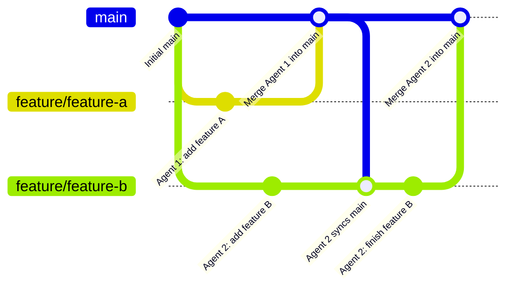

# Multi-Agent & Multi-Machine GitHub Collaboration Workflow

A practical guide for collaborating on SurgiFlow using two different computers and two separate AI agents simultaneously, keeping code in sync without merge conflicts.

---

## 1. How to Divide Work (Feature/Section Split)

> [!IMPORTANT]
> **Do not split pure "UI vs. Logic" for the same screen or component.**
> When Agent 1 edits the UI and Agent 2 edits the logic in the same file (e.g., `SurgiFlowApp.tsx`), both agents modify the exact same lines of code. This causes merge conflicts.

### Recommended Approach: Split by Feature / Domain
Give each computer / agent clear boundaries so they touch different directories and files:

| Machine / Agent | Scope / Domain Example | Typical Files Touched |
| :--- | :--- | :--- |
| **Computer 1 (Agent 1)** | Feature A (e.g., COIP / Microsaves / Data Sync) | `src/features/coip/`, `src/services/`, `scripts/` |
| **Computer 2 (Agent 2)** | Feature B (e.g., Room Board UI, Analytics, Export) | `src/components/`, `src/features/reports/`, styles |

---

## 2. Branching Strategy

Never allow both agents to commit directly to `main`. `main` is the verified source of truth.



---

## 3. Step-by-Step Daily Workflow

### Step 1: Before Starting Any New Task (On Either Machine)
Always ensure your local `main` branch is up to date:
```powershell
git checkout main
git pull origin main
```

---

### Step 2: Create a Dedicated Feature Branch
Before prompting the agent to write code, create and switch to a new branch:

**On Computer 1:**
```powershell
git checkout -b feature/coip-sync-enhancements
```

**On Computer 2:**
```powershell
git checkout -b feature/room-card-redesign
```

**Prompting the agent on that machine:**
> *"You are working in branch `feature/...`. You are only responsible for [Feature Name]. Do not modify shared root configurations or unrelated modules."*

---

### Step 3: Save Progress & Push to GitHub
When the agent finishes a logical unit of work:
```powershell
git status
git add .
git commit -m "feat(module): descriptive message about what was built"
git push -u origin feature/your-branch-name
```

---

### Step 4: Merge Into `main` via GitHub
When the feature is tested and complete:
1. Go to your GitHub repository: [github.com/ted1735/Surgiflow-RCC-Standalone-](https://github.com/ted1735/Surgiflow-RCC-Standalone-)
2. Click **Compare & pull request**.
3. Inspect the diff to make sure only the intended files were altered.
4. Click **Merge pull request** -> **Confirm merge**.

---

### Step 5: Syncing the Other Computer
Whenever one computer finishes and merges a feature to `main`, bring those changes into the second machine before continuing:

```powershell
# 1. Update your local main branch
git checkout main
git pull origin main

# 2. Merge latest main into your working branch
git checkout feature/your-active-branch
git merge main
```

If both agents worked on separate files, Git will complete the merge automatically (`Auto-merging... Merge made by the 'ort' strategy`).

---

## 4. Emergency: What to Do If a Merge Conflict Happens

If two agents happen to edit the same file and Git reports a conflict:

1. Run:
   ```powershell
   git status
   ```
   Git will list the files under `Unmerged paths: both modified: <file>`.
2. Open the file in your editor. Look for the conflict markers:
   ```text
   <<<<<<< HEAD (Current branch code)
   your changes
   =======
   incoming changes from main
   >>>>>>> main
   ```
3. Keep the valid parts from both sides and delete the `<<<<<<<`, `=======`, and `>>>>>>>` markers.
4. Finalize the merge:
   ```powershell
   git add <file>
   git commit -m "fix: resolve merge conflict between main and feature branch"
   ```

---

## 5. Summary Golden Rules

1. **Never commit directly to `main`** when running dual agents.
2. **One feature per branch**, one branch per computer.
3. **Split by distinct feature folders**, avoiding simultaneous edits to the same files.
4. **Pull latest `main` frequently** into your active branch to stay updated.
