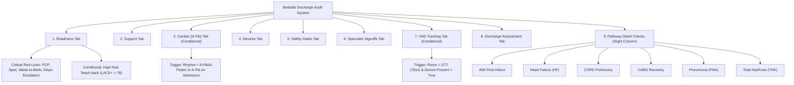

# SurgiFlow Bedside Discharge Audit Parameters — Full Structure & Logic Tree

This document provides a comprehensive structural and logical breakdown of all tabs, fields, parameters, and conditional red-line rules inside the **Bedside Discharge Audit** interface.

---

---

## Tab-by-Tab Detailed Audit Tree

### 1. Readiness (`activeTab = 'readiness'`)
> **Purpose**: Verify outpatient appointment bookings, medication delivery access, and post-discharge DME/service pre-authorizations.

* 🚨 **Critical Red-Line Checklist Items** (Trigger immediate red hazard warnings if `No`):
  * **PCP Follow-up**: Follow-up Scheduled & Booked with PCP within 7 days (`pcpFollowup`)
  * **Specialist Follow-up**: Follow-up Scheduled & Booked with Specialist within 7 days (`specFollowup`)
  * **Meds-to-Beds Access**: Meds-to-Beds verified & Cost barriers resolved (`medsToBedsAccess`)
  * **Dispo Escalation**: Escalation complete if recommended discharge disposition was declined (`dispDeclinedEscalation`)
* 📋 **Standard Checklist Items**:
  * **HHC Authorization**: HHC (Home Health Care) or SNF admission pre-authorized (`hhcAuth`)
  * **Bridge Services**: Bridge meds/supplies requested & arranged with community partners (`bridgeServices`)
  * **Pharmacy in AVS**: Correct pharmacy documented in after-visit-summary (`correctPharmacy`)
  * **Wound Care Instructions**: Wound care action instructions printed & verified (`woundCareInstructions`)
  * **DME Supplies**: All DME supplies (e.g. oxygen tanks, walkers) physically filled (`dmeSupplies`)
  * **Walk Test & O2**: 6-minute walk test verified & oxygen prescription active (`walkTestOxygen`)
  * **Escalation Gaps**: All identified checklist gaps reported up direct nursing leadership Chain (`escalationGapsCompleted`)
  * **Support Hotline**: 24/7 Support Hotline quick flyer placed in top of AVS packet (`hotlineFlyer`)
  * **Core-4 Toolkit**: Standard Medical Core-4 Self-Care Resource toolkit received (`core4PackGiven`)
* ⚡ **Conditional Injections**:
  * **High-Risk Extras** (Only appears if `riskLvl === 'High'`): Advanced diagnostic Teach-Back instructions (LACE+ > 78) (`highRiskEducation`)

---

### 2. Support (`activeTab = 'support'`)
> **Purpose**: Confirm multidisciplinary therapy, diet, consults, and inpatient vaccination compliance.

* 📋 **Checklist Parameters**:
  * **PT/OT Evaluation**: Physical Therapy (PT) Eval completed & documented (`ptEval`)
  * **Multidisciplinary Consults**: Registered Dietitian / OT / SLP consult completed as ordered (`multidisConsult`)
  * **Palliative / Hospice**: Palliative Consult / Hospice Care addressed as appropriate (`pallConsult`)
  * **Vaccination Status**: Hospital vaccination logs addressed (Flu, Pneumococcal, COVID) (`vaxStatus`)
  * **Opioid Bowel Prophylaxis**: Opioid bowel prophylactic regimen documented & sent (`opioidBowel`)
  * **Zone Tool**: Care education Zone Tool manual placed directly in patient hand (`zoneTool`)

---

### 3. Cardiac [A-Fib] (`activeTab = 'cardiac'`)
> **Condition**: Rendered when current rhythm is **Atrial Fibrillation** or **A-Flutter** (`isAfibRhythm(demographics.rhythm)`), or when A-Fib history was retained from admission.

* 🩺 **Classification Selection**:
  * Option 1: **Existing / Known A-Fib**
    * Patient arrived on established home anticoagulation & verified inpatient (`knownAcVerify`)
    * AC therapy medication resumed inpatient during stay (`knownAcRestart`)
    * Continuing AC regimen outlined on AVS with dosage/frequency (`knownAcAvs`)
  * Option 2: **New Onset A-Fib**
    * New A-Fib teach-back education packets documented & signed (`newAfibTeach`)
    * New Outpatient Anticoagulation (AC) prescription provided (`newAcPrescript`)
    * ⚠️ **Safety Trap Override** (Fires if `newAcPrescript === 'No'`): Is a documented bleeding risk or clinical contraindication explicitly filed? (`bleedingRiskDoc`)

---

### 4. Devices (`activeTab = 'devices'`)
> **Purpose**: Audit line/tube maintenance, teach-back, and supplies for patients discharged with devices.

* 🔌 **Toggle**: `Patient discharged with Lines/Tubes/Devices?` (`deviceChecks.hasDevice`)
* 📝 **Free-Text Specification**: `deviceList` (e.g. PICC Line, Pleurex, Foley, Wound Vac)
* 📋 **Checklist Parameters**:
  * **Presence Documented**: Device presence explicitly charted & entered into Transitions list (`devicePresenceDoc`)
  * **Care Plan & Supplies**: Maintenance care plan and supply order identified & submitted (`devicesAtDcIdentified`)
  * **Teach-Back**: Flush care instruction teachback successfully parsed with patient/family (`deviceTeachBack`)
  * **Follow-Up Aligned**: Clinical support or home health schedule aligned with PICC/line needs (`deviceFollowUpAddressed`)

---

### 5. Safety Gates (`activeTab = 'safety'`)
> **Purpose**: Final pre-exit bedside safety verification performed prior to patient leaving the floor.

* 🛡️ **Safety Gate Checks**:
  * **No Duplicate Meds**: Verify zero pharmacotherapy duplicate medication classes exist in AVS list (`noDupesAvs`)
  * **High-Alert Med Details**: Ensure next dose parameters & duration fields completed for high-alert meds (`medDetailsDuration`)
  * **Pharmacy Reconciliation**: Discharge medication list reconciliation completed by Pharmacy (`pharmRecon`)
  * **Transport Confirmed**: Secure transitions transport vehicle and driver confirmed (`transportConfirm`)
  * **AVS Bedside Review**: AVS documents printed, annotated, and physically reviewed at bedside (`avsPrintedReviewed`)
  * **Patient Teach-Back**: Patient or designated primary caregiver vocalized perfect teachback understanding (`patientUnderstand`)
  * 🚨 **Bedside Huddle**: Pre-Discharge Bedside Huddle achieved with nurse & unit leader prior to exit (`huddlePriorDc` - **Critical Red-Line**)

---

### 6. Specialist Signoffs (`activeTab = 'specialists'`)
> **Purpose**: Capture inpatient consult sign-offs and provider names mapped to SharePoint list schema.

Each specialty requires **Status** (`Yes` | `No` | `N/A`) and **Sign-off Provider Name**:
1. **Cardiology**: `cardiologySignoff` & `cardiologyName`
2. **EP Cardiology**: `epCardiologySignoff` & `epCardiologyName`
3. **Advanced Heart Failure**: `advancedHFSignoff` & `advancedHFName`
4. **CTS (Cardiovascular Thoracic)**: `ctsSignoff` & `ctsName`
5. **Pulmonary / Critical Care**: `pulmonarySignoff` & `pulmonaryName`
6. **Infectious Disease**: `infectiousDiseaseSignoff` & `infectiousDiseaseName`
7. **Hematology / Oncology**: `hemeOncoSignoff` & `hemeOncoName`
8. **Gastroenterology (GI)**: `giSignoff` & `giName`
9. **Nephrology**: `nephrologySignoff` & `nephrologyName`
10. **Hospice Care**: `hospiceSignoff` & `hospiceName`
11. **Palliative Medicine**: `palliativeSignoff` & `palliativeName`
12. **Endocrinology**: `endocrinologySignoff` & `endocrinologyName`
13. **Neurology**: `neurologySignoff` & `neurologyName`
14. **Neurosurgery**: `neurosurgerySignoff` & `neurosurgeryName`
15. **Other Miscellaneous**: `otherConsultantMisc` & `otherConsultantMiscSognoff`

---

### 7. VAD Tracking (`activeTab = 'vad'`)
> **Condition**: Rendered when patient is in **CPC Unit GT7** (Room 78xx) AND `deviceChecks.hasDevice === true`.

* ⚠️ **Mandatory Rule**: All mechanical assist device settings must be co-signed by an advanced VAD Certified Registered Nurse before discharge.
* ⚙️ **Parameters**:
  * **VAD Type**: `vadType` (e.g. HeartMate 3)
  * **Speed Setting**: `vadSpeed` (RPM)
  * **Dressing Change Order**: `vadDressingChangeOrder`
  * **Dressing Change Timestamp**: `dressingChanged`
  * **Driveline Photo Uploaded**: `vadPhotoUploaded` (`Yes` | `No` | `N/A`)
  * **VAD DSR Next Due Date**: `vadDsrNextDue`
  * **Certified RN Co-Signer**: `vadRN`
  * **Vital Signs Logs**: `vadVSq4AM` & `vadVSq4PM`
  * **Missing Equipment / DND Limits**: `vadMissingRequired`, `vadDND`, `vadCartNumber`
  * **Clinical Comments**: `vadMISCNOTES`

---

### 8. Discharge Assessment (`activeTab = 'clinical'`)
> **Purpose**: Centralized view of physical parameters, skin integrity, mentation, oxygenation, and social support.

* 🩺 **Assessment Fields**:
  * **Family Support**: `familySupportDischarge` (Free text)
  * **Braden Skin Score**: `braden` (e.g. 23)
  * **Mentation Status**: `mentation` (A&O, Forgetful, Confused, Virtual Sitter)
  * **Isolation**: `isolation` (None, Contact, Contact Plus, Droplet, Airborne)
  * **Telemetry Rhythm**: `rhythm` (Sinus, A-Fib, A-Flutter, Paced, Block/Other)
  * **Pulmonary Hypertension Meds**: `phMedication`
  * **Oxygen Device & Flow Rate**: `o2Device` & `o2FlowRate`
  * **Admit & Discharge Weight**: `admitWeight` & `weightToday`
  * **Functional Mobility**: `mobility` (Self, 1 Assist, 2 Assist, SBA, Bedrest)
  * **PO Pain Score**: `poPain` (0-10 scale)
  * **Hemodialysis (HD)**: `hdAtHomeOrInpatient`
  * **Fall Risk**: `fallRisk` (Low, Moderate, High - *Maroon alert styling if High*)
  * **Infusions & Anticoagulation**: Active Drips multi-select & Anticoagulant class multi-select
  * **Incentive Spirometer & Bowel Movement**: `is` & `bm`
  * **Discharge Lounge & Ride**: `dcLounge` & `rideAVL`
  * **Narratives**: `clinicalNeeds` & `nonClinicalDCBarriers`

---

### 9. Pathway Detail Checks (Right Column Bento Grid)
> **Condition**: Injected into the right panel based on diagnoses selected in `demographics.coreDiags`.

1. **Heart Failure (HF)**:
   * Standardized HF discharge order set processed (`orderSetUtilized`)
   * Daily weight log card and tracker booklet given (`dailyWeights`)
   * Sodium fluid dietary restrictions outlined on AVS (`sodiumFluidRestriction`)
   * 🚨 Target physiological Dry Weight documented (`dryWeightOnAvs` - **Critical**)
   * 🚨 Diuretic dose/duration instructions verbalized (`diureticPlanDoc` - **Critical**)
2. **COPD Pulmonary**:
   * Inhaler / nebulizer regimen optimized inpatient (`inhalerRegimenOptimized`)
   * Spacer & inhaler spacer teach-back completed (`inhalerTechniqueEdu`)
   * Steroid & antibiotic rescue pack documented (`steroidAntibioticPlan`)
   * Inpatient tobacco cessation program session achieved (`smokingCessation`)
   * Pulmonary Rehabilitation referral request active (`pulmonaryRehabReferral`)
3. **AMI Post-Infarct** (Red-Line Core Measures):
   * DAPT Configured (`medsDapt`)
   * High-Intensity Statin (`medsStatin`)
   * Beta-blocker Rx (`medsBetaBlocker`)
   * ACEi / ARB / ARNI (`medsAceArbArni`)
   * Cardiac Rehab referral in place (`cardiacRehabReferral`)
4. **CABG Recovery Plan**:
   * Antiplatelet, Statin, Beta-blocker checkboxes
   * Sternal wound care, activity restrictions, glycemic control plan
5. **Pneumonia (PNA)**:
   * Discharge steroid/antibiotic duration, incentive spirometry, home infusion reservation
6. **Total Hip / Knee (THK)**:
   * VTE prophylaxis, weight-bearing status, PT/OT arranged, DME arranged, pain med education

---

## Summary Matrix

| Tab Name | Main Target / Purpose | Key Logic & Rules |
| :--- | :--- | :--- |
| **1. Readiness** | Appointments & DME | 4 Critical Red-Line items; High Risk Teach-back if `High` |
| **2. Support** | Therapies & Vaccines | PT/OT, Dietitian, Bowel Prophylaxis, Zone Tool |
| **3. Cardiac [A-Fib]** | Anticoagulation | Conditional on A-Fib; Safety Trap override if no AC written |
| **4. Devices** | Lines & Tubes | Active when `hasDevice === true`; verifies teach-back & supplies |
| **5. Safety Gates** | Pre-exit Check | 7-point safety list; mandatory Bedside Huddle Red-Line |
| **6. Specialist Signoffs** | Inpatient Consults | 15 specialty sign-off status & provider name entries for SharePoint |
| **7. VAD Tracking** | Mechanical Assist | Conditional on GT7 CPCU & device; requires VAD RN co-sign |
| **8. Discharge Assessment**| Clinical Status | Baseline vitals, weight, pain, oxygen, fall risk, mobility |
| **9. Pathway Checks** | Specific Protocols | Injected dynamically per diagnosis (HF, COPD, AMI, CABG, PNA, THK) |
